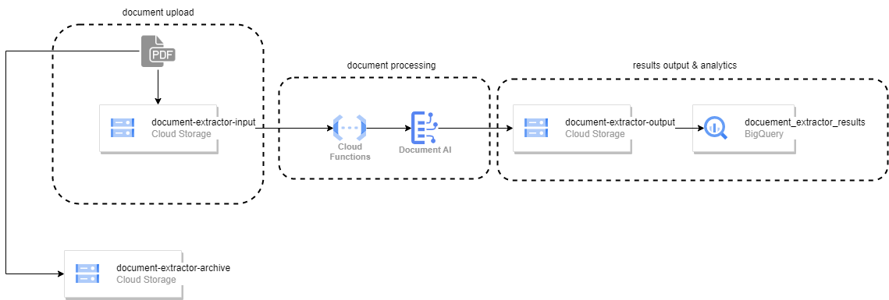

# drivingLicenseProcessor

# Overview
The Driving License processor is designed to help submit Drving license details and other documents details quickly and efficiently, minimising user error . Leveraging the GCP Document AI service in order to detect details and then convert them into digital format.  The advantage of this is allowing users to submit detials by just taking and uploading a photo, instead of manually filling out a form. This reduces the time and effort needed to complete registration processes.

# Architecture


# Components
what has been implemented
- GCS Input and Output buckets
- Document AI 

what has to be implemented
- Cloud Functions - when document is stored in Input bucket, trigger call to Documnet AI service
- BigQuery - deploy job remotely 
- GCS - create archive bucket

# Training and Running the driving license processor
## Setup

* Enable the Document AI APIs
```
$env:PROJECT_ID="<PROJECT_ID>"

gcloud config set project <PROJECT_ID>

gcloud services enable documentai.googleapis.com
```

* Create a json file ```key.json``` to store the service account key
* Create a Service Account and grant it "Docuemnt AI Editor", "BigQuery User", and "BigQuery Data Editor" role
```
$env:SERVICE_ACCOUNT_NAME="documentai-processors"
$env:SERVICE_ACCOUNT="$SERVICE_ACCOUNT@$PROJECT_ID.iam.gserviceaccount.com"
$env:GOOGLE_APPLICATION_CREDENTIALS="key.json"

gcloud iam service-accounts create documentai-processors

gcloud projects add-iam-policy-binding $PROJECT_ID --member "serviceAccount:$SERVICE_ACCOUNT" \
                                                    --role "roles/documentai.editor"

gcloud projects add-iam-policy-binding $PROJECT_ID --member "serviceAccount:$SERVICE_ACCOUNT" \
                                                    --role "roles/bigquery.dataEditor"

gcloud projects add-iam-policy-binding $PROJECT_ID --member "serviceAccount:$SERVICE_ACCOUNT" \
                                                    --role "roles/bigquery.user"
```
* Create and download the service account key
```
gcloud iam service-accounts keys create $GOOGLE_APPLICATION_CREDENTIALS --iam-account $SERVICE_ACCOUNT
```
* Install required python packages
```
pip install google-cloud-documentai google-cloud-bigquery
```

## Train a UK driving license processor
* In GCP console, navigate to Document AI page and click on "CREATE CUSTOM PROCESSOR" to create a custom processor. Enter a processor name and select the region.
* Navigate to Cloud Storage and create a bucket "driving-license-training-data". Upload ```driving-license-train-data``` and ```driving-license-test-data``` folders to the bucket.
* Navigate to Document AI and go to the custom processor detail page and click on "SET DATASET LOCATION". Select the bucket location as the "Destination Path" and click on "CREATE DATA SET".
* Navigate to the "Train" tab. Click on "IMPORT DOCUMENTS" and import all the data stored on the gcs bucket. In the "Data split" field, mark the data as '
"Training" when upload the documents from the "driving-license-train-data" folder. Mark the data as 'Test' when uploading the documents from "driving-license-test-data" folder. In this demoAt the moment, 10 documents have been used to train the processor, and 10 documents have been used to test it.
* Click on "EDIT SCHEMA" and add the following labels by clicking "CREATE LABEL".

| Name           | Data type   | Occurrence    |
|----------------|-------------|---------------|
| address        | Plain text  | Required once |
| date-of-expiry | Plain text  | Required once |
| date-of-issue  | Plain text  | Required once |
| dob-pob        | Plain text  | Required once |
| first-name     | Plain text  | Required once |
| issued-by      | Plain text  | Required once |
| last-name      | Plain text  | Required once |
| license-number | Plain text  | Required once |
| type           | Plain text  | Required once |
| valid-from     | Plain text  | Required once |
| valid-to       | Plain text  | Required once |
* Select one of the imported documents and label all the fields (Highlight the text on the image and choose the correct label). After identifying all the fields, click on ```MARK AS LABELLED```. All the imported documents need to be labelled before training the processor.
* After labelling all the documents, click on "TRAIN NEW VERSION". Enter the version name, and click on "START TRAINING".
* After training is complete, go to the 'MANAGE VERSIONS' tab and deploy the trained version. Once the version has been deployed, an endpoint will be available under the 'PROCESSOR DETAILS' tab.

## Process a driving license using the trained processor
Open a jupyter notebook or a ```.py``` file. Run the following code

```python
from driving_license_processor import send_processing_req, process_document

PROJECT_ID = os.getenv("PROJECT_ID", "") # change to your own project id
LOCATION = 'us' # change to your document ai location
MIME_TYPE = 'application/pdf' # document type
PROCESSOR_ID = '16c52250499a3864' # change to the id of your trained processor
file_path = 'license.pdf' # change to your document path

document_object = send_processing_req(PROJECT_ID, LOCATION, PROCESSOR_ID, file_path, MIME_TYPE)
```

## Save the output results to Bigquery
Output the document ai object to Big Query. Create a dataset in BigQuery to store the output results. If you wish to store the output to a new table, change the ```ENTITIES_TABLE_NAME``` to a new table name. If the new table does not exist in the dataset, ```process_document``` will create a new table.

```python
DATASET_NAME = 'document_extractor_results' # change to your own dataset name
ENTITIES_TABLE_NAME = 'driving_license_extracted_entities' # change to the table you'd like the results to be stored

process_document(document_object, file_path, DATASET_NAME, ENTITIES_TABLE_NAME)
```

You can view the output results in BigQuery:
```python
from google.cloud import bigquery

# Construct a BigQuery client object.
client = bigquery.Client()

query = f"""
    SELECT *
    FROM `{PROJECT_ID}.{DATASET_NAME}.{ENTITIES_TABLE_NAME}`
    LIMIT 20
"""
query_job = client.query(query)  # Make an API request.
```
